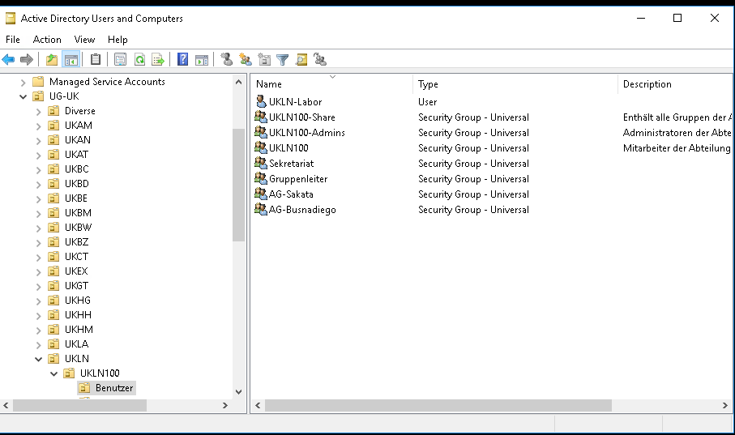
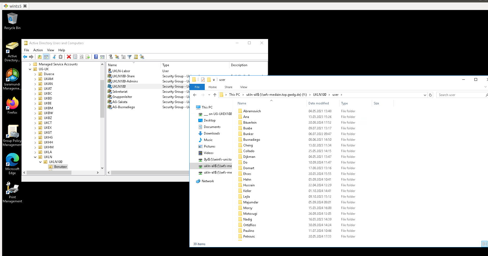
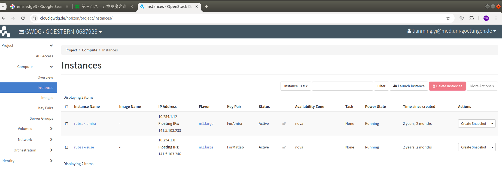

# 1 IT 工作

## 1.1 wiki系统

https://rubsak.wiki.gwdg.de/

用户名和密码需要管理员添加和告知，Tat也拥有管理员权限。

## 1.2 管理员账号和权限

管理员工作交接时，新的管理员需要创建相关账号和获取权限。

zero account，这个账号是管理员专用账号，用户名以0开头。某些管理权限只能分配给zero account，需向GWDG申请。

[ipam](https://ipam.gwdg.de/)系统的权限，需要允许用户管理某些网段，需向GWDG申请。

HPC权限，HPC的软件安装目录权限，需要移交给新任管理员，需向HPC申请。

Matlab证书的管理员权限。

[GWDG cloud](https://cloud.gwdg.de/horizon/project/instances/)，用户需要向GWDG申请开通cloud访问权限，rubsak-amira和rubsak-suse两个实例的管理权，访问密码和证书也需要移交。

Active Directory的管理权限，需要将新管理员账户添加到Active Directory对应的管理员组，这个步骤前管理员可以完成。

storage server等我们自身维护的服务器的密码密钥。办公电脑的管理员账号。

## 1.3 管理网络

### 1.3.1 物理连接

办公电脑和服务器分布于GZMB和Physics两栋大楼中，它们都通过网线连接到墙上或者交换机上的网络插口当中。

在连接设备之前，我们需要确保这些网络插口已经正确的连接到核心网络，并设置了正确的VLAN.

每个VLAN对应不同的网络地址段，可以为每个VLAN配置网络规则。

我们拥有三个VLAN的三个网络地址段管理权限，具体内容在IPAM段落中讲解。

物理连接过程就是确保墙上端口或交换机上端口连接并配置到了指定的VLAN ID上。

不同位置的网络端口有不同的配置流程，可以分为三类。

1. GZMB的墙上网络端口，确定好端口的房间号和端口号之后，联系ground floor的GZMB网络管理员，我目前没有他的邮箱。从前没有GZMB网络管理员，我通过此联系人：Wegner, Alexander Peter <alexander.wegner@med.uni-goettingen.de>，他会帮助patch网络端口，但是他最近很忙，最好通过GZMB网络管理员进行端口匹配。
2. Physics位于走廊上的交换机，只需要将交换机编号和端口编号通过邮件告知<support@gwdg.de>，并告知需要匹配的VLAN编号，对方会远程完成设置。
3. Physics的墙壁端口，需要记下端口的编号，到D-1.109房间，将机柜右侧的墙上端口连接到交换机指定端口上即可。

另外，Physics上的交换机，如果要使用10G网络，需要连接到10G SFP接口，要根据电脑的网口使用适当的SFP Module. 交换机为Aruba品牌，需要确保SFP Module兼容交换机型号，可以咨询GWDG support，提供交换机编号，以获取确切的对SFP Module的要求。

目前所有需要使用10G网络的服务器都已经配置了10G网络连接。

### 1.3.2 IPAM在线网络设置


通过https://ipam.gwdg.de/ 这个网址，可以IPAM系统在线配置网络。

在这里我们有三个可用网段：

1. VLAN 79，134.76.79.50~134.76.79.70, 134.76.79.200~134.76.79.210，此网段用于管理需要公网IP地址的设备，由于安全性和GWDG防火墙的限制，我们逐渐不再使用此网段。少量设备仍部署在此网段。
2. VLAN 425，10.143.192.0/24，此网段是最常用网段，内网IP，外部可以通过VPN访问，此网段可访问互联网。大部分设备都配置在此网段上。
3. VLAN 426，10.143.193.0/24，这是一个不可访问互联网的网段，因此我们并未使用。如果有需要高安全性的内部设备，可以使用此网段，不可访问互联网能提高安全性。

除了在IPAM系统上可以查看计算机被配置在哪个IP地址之外，在group storage内还有一个文档，记录了墙上端口，计算机以及IP地址的对应关系，路径为IT-works/devices.xlsx

### 1.3.3 连接eduroam

很多问题可以通过搜索GWDG + 问题名称找到在线文档解答。

例如搜索GWDG + eduroam可以找到这篇文档：

https://docs.gwdg.de/doku.php?id=de:services:network_services:eduroam:start

参照上面的内容可以解决无线网络连接的问题。

### 1.3.4 其它

我们的所有网络位于一个名为GONET的网络内，它有一些访问规则和限制。

默认情况下所有IP地址只能在GONET内访问，即使是公网IP地址也限制了所有端口的访问。

这线限制可以通过和<support@gwdg.de>沟通进行调整。例如要求某个网段可以通过VPN访问，并开放某些端口限制。

目前22号的ssh端口和3389号的RDP端口都对VPN连接开放，可以通过VPN连接实现远程访问。

由于GWDG防火墙的限制，目前并未能找到外部用户，也就是不使用vpn的用户，通过ssh或者ftp等协议直接向我们的服务器传输数据的方法。

未来有大量外部数据传输的需求，或许可以参考这篇文档中的方法：

https://docs.hpc.gwdg.de/how_to_use/data_transfer/index.html

## 1.4 管理计算机和服务器

需要对新计算机和服务器安装系统，设置权限，安装必要软件。

处理一些软件安装遇到的疑难问题，或者解决一些硬件故障。

### 1.4.1 安装新机器

GWDG提供了一个叫做Baramundi的系统管理软件，它是付费的，可以实现远程安装操作系统，远程安装软件，远程设置等功能。但是由于它的使用有一定门槛，我们的设备也不多，因此我们没有使用它。

我制作了几个不同的启动U盘，用于安装不同操作系统。

#### 1.4.1.1 Windows办公电脑

##### 1.4.1.1.1 系统和软件安装以及激活

通过启动U盘安装Windows操作系统，可以根据用户需求选择Windows10或者Windows11。

需要选择Windows Education Pro版本，Pro版本才能提供Active Directory支持。

设置用户名密码时，使用统一的本地管理员用户名和密码，方便管理。这部分私密信息私下分享。

安装操作系统后，目前仅有Office软件是装机必备软件。

通过KMS服务激活Windows和Office软件，一些软件安装包和激活脚本我放在了U盘中。

我们也有一个github仓库存储这些脚本：https://github.com/rubenlab/it-scripts

[使用KMS激活系统和软件](https://docs.gwdg.de/doku.php?id=en:services:general_services:software_and_license_management:mskms)

使用KMS前，需要保证系统或软件的Product Key是符合要求的，在U盘的脚本中都做了处理。激活office用到两个脚本，先使用其中一个修改Product Key，再用另外一个脚本通过KMS激活。

##### 1.4.1.1.2 Active Directory以及权限设置

对于办公电脑，另外一个工作是将计算机添加到Active Directory Domain，我们的Domain是vk-med.uni-goettingen.de. 在右键电脑，管理页面，高级rename里可以进行设置。

电脑添加到Activate Domain并重启之后，需要使用GWDG账号才能登陆。登陆名是GWDG\用户名，密码和GWDG账号以及邮箱的密码一样。
其中GWDG\是domain名称，对于学生账号，前缀名称会有不同。对于账号的讲解在Active Directory中详细讲解。

为了让电脑的使用者能够拥有足够的权限，需要将用户添加到local group的Administrator, Device owner和Remote access三个group中。

Administrator权限让用户能够自由安装自己所需软件，Device owner让用户可以设置邮件app等应用，Remote access权限让用户可以远程办公。

另外在local group policy中，需要设置关闭用户的profile同步功能，仅使用local profile，否则会遇到登陆时间过长的问题，原因是花很多时间从网络同步用户的user profile.

##### 1.4.1.1.3 驱动安装

通过driver booster自动安装必备软件，注意安装driver booster过程中，取消关联软件的勾选，避免安装不必要的软件。然后使用driver booster的扫描和自动安装安装必要驱动。

安装完成后，可卸载driver booster. 有时随着系统自动升级，会出现driver版本低引起的一些硬件问题，如网络自动断开，此时需要再次用driver booster升级驱动。

##### 1.4.1.1.4 连接网络

首先需要测试要使用的墙上端口是否可用，可以用笔记本电脑+USB网络适配器进行测试，这个USB网络适配器我将它的MAC地址设置到了我们正在使用的两个网段上。如果笔记本电脑能通过它连接网络，再进一步查看连接后的IP地址，即可知道此端口的配置情况。

然后查询电脑的MAC地址，将MAC地址配置到IPAM系统中，即可完成网络配置。网络配置不是立即生效的。

[IPAM Deployment schedules](https://docs.gwdg.de/doku.php?id=en%3Aservices%3Anetwork_services%3Aipam%3Astart)

##### 1.4.1.1.5 连接打印机

参考下面文档：

https://rubsak.wiki.gwdg.de/doku.php?id=computers:print&s[]=printer

由于打印机只能为某个用户连接，需要用户在场登陆自己账号后方可配置打印机连接。

通过wifi连接打印机收到Active Directory权限限制，而打印机是我们借用其它实验室的，因此我们没有设置权限，只能使用有线连接到打印机。

#### 1.4.1.2 Linux服务器

Linux服务器的安装比Windows简单，通过启动U盘安装即可。

需要注意的是分区设置，为系统路径/和用户路径/home设置不同的分区有利于系统升级，但是通常我们只设置一个/分区。

网络设置方式和前文一样。

我们通常选择Ubuntu或者Linux Mint操作系统，目前的服务器上大多安装的是Linux Mint操作系统。

#### 1.4.1.3 双系统办公电脑

双系统安装通常我们先安装Windows系统，如果是需要改造已有Windows系统，需要先shrink磁盘空间，留出足够的空间给第二个操作系统。

安装第二个系统时，要选择手动配置磁盘分区，选择空闲的磁盘位置安装操作系统即可。

### 1.4.2 已有服务器介绍

以下的服务器顺序，是服务器机架中从下到上的服务器排布顺序。

Linux服务器都安装了ssh服务和xrdp服务，既可以通过ssh命令行访问，也可以通过rdp客户端以图形界面方式访问。

xrdp服务支持多用户同时访问，但是一个账号同时限制一人访问。

#### 1.4.2.1 Storage server

IP 10.143.192.12

这是一个truenas存储服务器。它拥有8个SSD磁盘托架（已使用7个），和28个HDD磁盘托架（全部使用）。

7个SSD磁盘通过硬件raid controller配置为一个逻辑磁盘，安装了truenas系统。有一个空余的SSD插槽，里面有一个损坏的SSD磁盘并未配置进磁盘阵列，并且它导致指示灯为红色。通过raid controller配置的磁盘阵列，可以在bios中配置，也可以根据raid controller型号找到对应的专业软件进行查看和配置。目前我们只使用bios配置，要查看其健康状况也只能重启服务器进入bios中查看。

28个HDD磁盘通过truenas的软件配置，配置成了一个大的磁盘pool.

这个pool通过NFS协议为我们的其它服务器提供远程磁盘挂载服务，其它服务器可以将数据拷贝到storage服务器进行存储。

truenas服务器拥有管理界面，可以通过服务器的ip地址进行访问，可以通过网络资源学习如何管理truenas系统。

Truenas上有一个关键用户，名为falcon4，再它的home目录内，有一些关键目录和脚本。

`/mnt/pool1/home/falcon4/share`目录，这个目录为共享目录，在truenas的NFS协议配置页面可以看到共享此目录的相关设置，其它服务器也可以远程挂载此目录。

`/mnt/pool1/home/falcon4/mount-f4.sh`，每次重启服务器之后，执行此脚本将falcon4 server的磁盘加载到storage server上，方便后续同步工作。

`/mnt/pool1/home/falcon4/sync-falcon4.sh`，开启一个tmux后台session，然后执行此脚本，这个脚本会循环执行rsync命令，不断将falcon4 server上的数据同步到/mnt/pool1/home/falcon4/share/f4server目录中。

`/mnt/pool1/home/falcon4/tohpc.sh`，这个脚本用于手动将数据传输到HPC，一般不会直接使用，而是在其它应用服务器，如pre-processing服务器上调用此脚本。这个脚本用到管理员账号（目前是我的，yi1）的无密码证书，因此如果更换管理员，需要修改脚本使用可用的账号。

#### 1.4.2.2 Pre-processing server

IP 10.143.192.4

用于电镜数据处理。IT管理员协助维护即可。

此服务器的特殊之处在与它连接了两条网线，一条配置在10.143.192.x网络，另外一条配置在134.76.79.x网络，这让它可以通过外部网络直接访问。

原本的向发是用这台服务器提供一个外部合作者可以传输文件的通道，但是由于GWDG防火墙的原因，需要的端口无法开放，因此这一尝试失败了。

#### 1.4.2.3 Falcon4 server

IP 10.143.192.13

冷冻电镜专业服务器，IT管理员管理其网络配置，电源连接等即可，我们无法登陆和配置此服务器。

此服务器的网络设置特殊，有多个网络端口，有一个是内部使用（和冷冻电镜设备交互），另外一个是外部使用（和我们的服务器交互，连接到交换机和我们的网络，使用10.143.192.13这个IP地址），如有问题，是Thermofisher修改了服务器的网络配置。如果自己不能解决，可以请求Thermofisher工程师协助处理。

#### 1.4.2.4 Cryosparc server

IP 10.143.192.14

Cryosparc服务器，主要用于数据处理。IT管理员协助维护即可。

Cryosparc server有两块7TB的NVME SSD硬盘，和一个由18块7TB SSD组成的raid磁盘阵列，此磁盘阵列使用硬件raid controller配置，需在bios中查看健康状态和修改配置。

#### 1.4.2.5 WarpM server

IP 10.143.192.16 另外一台数据处理服务器，目前是windows系统，准备安装双系统。

#### 1.4.2.6 服务器机架

IP 10.143.192.15

这是一个隔音机架，它的散热能力在夏天可能不足。联系Helen Bignell <helen.bignell@therackpeople.com>，这是机架供应商，看看他们能否提供更多散热组件帮助我们。

访问它的IP地址可以看到管理页面，用户名密码私下提供。

#### 1.4.2.7 备用电源

机架的最下方有一个备用电池设备，但是它内部的电池组件过期了，需要更换，否则不能起到备用电源的作用。

#### 1.4.2.8 远程磁盘加载

通过修改/etc/fstab文件，可以在每次开机时自动加载远程磁盘。

加载Falcon4 storage的配置:

10.143.192.13://bigdata/StorageServer/OffloadData /mnt/f4server nfs4 _netdev,rw

加载storage server的配置：

10.143.192.12://mnt/pool1/home/falcon4/share /mnt/storage nfs vers=3,_netdev,rw

如果开机没有完成加载，通过`sudo mount -a`指令手动重新加载，如果遇到报错，再根据错误信息分析问题原因。

### 1.4.3 其它

关于通用管理员账号和密码，有两套，少部分机器使用admin_lokal这个账号作为管理员账号。

GZMB有一些用于操控实验设备的PC，有时遇到问题需要处理，例如磁盘空间不足，网络无法连接等。

位于GZMB的AKTA和AKTA PC，有时出现连接问题，是因为AKTA PC和其它实验室共用，有时akta pc的网络连接或者设置会被变更。akta pc有两个网络插口，只有一个是我们需要的，发生过网口插错的情况，也发生过DHCP自动获取IP地址被设置为static ip的情况。

有时出现PC磁盘空间不足的问题，先使用treesize这款免费工具分析磁盘占用的原因，再进行处理。

其中常见的原因是没有管理计算机的自动同步远程目录功能，导致自动同步的文件过多，可以看到C盘的CSC目录占用大量磁盘空间。此目录难以直接删除，首先需要在sync center关闭同步设置，然后需要使用管理员账号进行一些权限设置，之后才能删除此目录，具体情况可以在网络上搜索如何删除Windows CSC目录。

## 1.5 group storage

这是我们内部存放共享文件的一个共享目录。

如何连接参考此文档：

https://rubsak.wiki.gwdg.de/doku.php?id=computers:share&s[]=ukln100

如何设置group storage的访问权限，添加新用户，放再Active Directory章节讲述。

## 1.6 Active Directory

Active Directory是一个windows服务，它能管理很多事情，具体信息可在网络查询。

我们主要使用它实现用户用GWDG账号登陆PC（前文提到），以及设置共享目录的访问权限。

我们拥有两个Active Directory分组，UKLN100和UKEX100，UKLN100用于管理group storage，UKEX100用于为计算机分配Active Directory名称。

### 1.6.1 管理group storage权限

通过远程桌面软件访问gwd-wints5.top.gwdg.de.

点开桌面Active Directory应用，右键点击top.gwdg.de，change domain切换到vk-med.uni-goettingen.de，选择UG-UK，选择UKLN，再选择UKLN100


进入如下图的角色管理页面中：



这里主要的角色是UKLN100-Admins和UKLN100，

将任何用户添加到UKLN100-Admins组内，此用户即可拥有管理员权限，可以管理UKLN100用户组。

UKLN100用户组，通常有实验室新成员时，需要将新成员添加到这个用户组，并在user目录下，以用户Last Name创建目录，并修改新创建的目录权限，去除UKLN100用户组的访问权限，添加目录用户的Full Control权限。



### 1.6.2 为计算机分配Active Directory名称

和UKLN100同理，打开UKEX100，点击计算机，可以看到已有计算机列表。

有新的计算器需要连接到Active Directory，按照既有命名规则，在此添加即可。

前文提到过如何将电脑添加到Active Directory Domain，在rename步骤，使用和这里相同的名称，电脑就可以正确接入Active Directory Domain.

注意每台计算机的active directory名称必须唯一，当两台机器名称冲突时，会出现其中一台无法连接到active directory，导致无法登陆的问题。此时协调计算机名称保持唯一，将出现问题的机器用管理员账号先断开active directory，再重新连接可以修复此问题。


## 1.7 HPC和服务器的软件安装

HPC介绍：https://rubsak.wiki.gwdg.de/doku.php?id=computers:hpc&s[]=hpc

### 1.7.1 HPC目录结构

#### 1.7.1.1 用户个人目录：`/usr/users/${USER}`

此目录空间较小，每个用户的使用空间独立，用于存储个人文件。

#### 1.7.1.2 组目录：`/scratch1/projects/rubsak`


我们的实验室所有HPC用户共享此目录，每个用户以自己的First Name建立属于自己的目录。

rubsak目录有数百TB的存储空间，用于存储和处理实验数据。尽管此目录空间很大，不活跃的数据仍需要备份并存储在archive目录，防止磁盘空间不足。

`/scratch1/projects/rubsak/from-storage`目录，用于存放从storage server中传输过来的数据，为了方便传输，这些文件会以管理员身份传输，传输完成之后，需要确保组内用户有写权限，以便用户可以将文件移动到自己的目录内。

通过`chowntome`指令（`alias chowntome='/usr/users/rubsak/sw/archive/chowntome.sh'`），用户可以将目录的所有人变更为自身。

#### 1.7.1.3 管理员目录：`/usr/users/rubsak/sw`

此目录权限归属管理员所有，用于安装HPC上的共享软件。

### 1.7.2 HPC文件备份

位于`/scratch1/projects/rubsak`目录内的不活跃文件，应该将它们移动到archive磁盘中。archive磁盘是一个磁带存储系统，磁带存储系统适合存储少量大文件，因此需要将目录或多个小文件压缩为一个大文件，之后再移动到archive磁盘中。同时这个文件大小也不能超过1TB，否则超出单个磁带的存储能力。

官方文档：https://docs.hpc.gwdg.de/how_to_use/the_storage_systems/data_stores/archive_perm/index.html

#### 1.7.2.1 用户个人文件备份

位置：`/usr/users/a/${USER}`

我们使用`backup`命令(`alias backup='/usr/users/rubsak/sw/archive/backup.sh'`)帮助用户对目录进行备份。

```
Usage：backup.sh [option]... file
Backup a folder or a file to /usr/users/a/yi1/backup folder.
  -t, --top archive every top file inside specific folder.
  -d, --dest=DEST default dest folder is backup, change it to some other path. It should be a relative path to /usr/users/a/yi1
  -v, --verbose show verbose output during the tar operation.
```

这个命令会自动将目录拆分成若干个不大于500GB的压缩文件，并将压缩文件移动到archive目录中。

想要从备份中恢复文件时，使用`restore`命令(`alias restore='/usr/users/rubsak/sw/archive/restore.sh'`)，usage: `restore.sh ${archive_folder} ${output_folder}`.

#### 1.7.2.2 管理员archive目录

位置：/usr/users/a/rubsak/share

管理员拥有此目录，其它用户有读权限。

已经离职人员的不活跃数据，也应该创建归档文件，并移动到此目录中管理。

目前这里存储的重要数据是/usr/users/a/rubsak/share/mpi_data/目录，是从马克思普朗克研究所移动过来的接近300TB数据。

这个文档里记录了创建这些备份文件的过程，以及如何恢复这些数据：

https://github.com/rubenlab/discuss/blob/master/mpi_archive.md

`/usr/users/rubsak/sw/archive/mpi`目录中，可以找到索引文件，记录了每一组archive目录对应的原始文件信息。例如`/usr/users/rubsak/sw/archive/mpi/pool-ruben2-goett/Tat/index.txt`这个文件记录了`/usr/users/a/rubsak/share/mpi_data/pool-ruben2-goett/Tat`目录所归档的文件信息。

如果用户希望从mpi归档中恢复某些数据，可以通过index.txt查找和确定数据所在位置，然后恢复归档所在的目录。

### 1.7.3 已安装软件和维护方式

HPC上的软件大部分都安装在`/usr/users/rubsak/sw`目录中。

大部分软件使用conda或者singularity容器的方式安装，wiki中记录了它们的使用方式：

https://rubsak.wiki.gwdg.de/doku.php?id=computers:sw&s[]=software

通常可以在`/usr/users/rubsak/sw`目录中根据软件名称找到它们的目录。而如果是通过conda安装，在`/usr/users/rubsak/sw/conda`目录中还可以找到软件conda环境所在目录。

通常通过[singularity容器](https://docs.gwdg.de/doku.php?id=en:services:application_services:high_performance_computing:singularity)安装的软件很稳定，不会随着时间推移而出现问题。

通过conda安装的软件，由于HPC环境的conda版本升级，有出现过因为版本不匹配而无法使用的情况，此时需要确定conda环境使用了什么conda版本，修改软件加载命令，指定conda的版本来解决此类问题。

所有软件模块，通过`/usr/users/rubsak/sw/rubsak.bashrc`文件进行加载，这个文件加载了必要模块，并定义了软件加载指令。

少量已经安装的软件，以及今后可能安装的软件，推荐使用module-system安装和维护。module-system在下文详述。

### 1.7.4 module system

HPC使用[Lmod](https://lmod.readthedocs.io/en/latest/) module system管理软件安装加载。

HPC文档：https://docs.hpc.gwdg.de/software_stacks/module_basics/index.html

我们在`/usr/users/rubsak/sw/module-system`目录中也部署了我们的模块，集合进HPC的Lmod系统。在module load指令中可以加载我们自己的模块。

我们自定义的模块之所以能够被加载，是因为我们在`/usr/users/rubsak/sw/rubsak.bashrc`文件内添加了这条指令：`module use /usr/users/rubsak/sw/module-system/modulefiles 2> /dev/null`

#### 1.7.4.1 /usr/users/rubsak/sw/module-system目录结构


`/usr/users/rubsak/sw/module-system/app`目录，这是从马克思普朗克研究所拷贝来的模块定义目录，app/install目录记录了各个模块的安装脚本，app/modulefiles目录记录了模块定义文件。

`/usr/users/rubsak/sw/module-system/sys`目录和上文app目录相似，只是这里的模块都是系统模块。

`/usr/users/rubsak/sw/module-system/install`目录，这个目录内存放经过验证，能在HPC执行的模块安装脚本。

`/usr/users/rubsak/sw/module-system/soft`目录，install脚本安装的模块应安装到此目录。

`/usr/users/rubsak/sw/module-system/modulefiles`目录，已安装模块的模块定义文件所在目录。

`/usr/users/rubsak/sw/module-system/copymodule.sh`，这个脚本用于将app或者sys目录的模块拷贝到install和modulefiles目录，它除了拷贝对应文件，还会修改文件中的路径以适应HPC环境中的路径。

Usage: `./copymodule.sh [--sys] {software_name} {version}`

copymodule并不能完全解决适配问题，仍需要阅读和测试install和modulefile脚本，以确定它们能在HPC中运行。

### 1.7.5 本地服务器上的module system

目前在cryosparc服务器上也部署了module system

lmod安装位置：`/opt/lmod`

有三个配置文件：

`/etc/profile.d/z00_lmod.sh`，开机自动加载的lmod配置文件，加载lmod基础设置。

`/etc/profile.d/z01_modules.sh`，自定义的开机加载模块，在z00_lmod.sh执行完成后执行。

`/opt/lmod/lmod/init/.modulespath`，文件内容为`/home/rubsak-admin/modulefiles`，它定义了从哪里加载modulefiles。

`/home/rubsak-admin/install`目录里存储了模块的安装脚本。需要安装新模块时，参考HPC中的模块安装，对路径做一些修改即可。

### 1.7.6 github代码仓库

我们在github上建立了一个organization，https://github.com/rubenlab

下面是对于一些repository的介绍：

[it-scripts](https://github.com/rubenlab/it-scripts)，存储IT管理员使用的一些脚本。

[slurm-scripts](https://github.com/rubenlab/slurm-scripts)，这个仓库记录HPC上已经安装的软件，如何编写[slurm](https://docs.gwdg.de/doku.php?id=en:services:application_services:high_performance_computing:running_jobs_slurm)提交脚本。slurm是HPC的任务管理系统。

[discuss](https://github.com/rubenlab/discuss)，这里记录了一些IT任务的讨论，以及mpi数据归档过程的详细信息。

## 1.8 Matlab和Amira证书服务器管理

Matlab和Amira的证书都通过GWDG cloud提供的虚拟服务器提供。

激活[GWDG cloud](https://cloud.gwdg.de/horizon/project/instances/)权限，并转移instances之后，可以看到两个计算机实例。



### 1.8.1 Matlab证书服务器

IP地址：141.5.103.246

matlab证书如果需要升级，或者购买新证书等，本人没有操作过，但是有网络资源，也可以咨询matlab服务人员。

### 1.8.2 Amira证书服务器

IP地址：141.5.103.233

可以通过ssh访问。

可以通过141.5.103.233:8090查看管理页面。

可能会有购买新license和升级license的需求。

具体如何升级license，由于本人没有操作过，只能留下之前交接时的文档和视频，以供参考。

## 1.9 软硬件采购

一些类似SFP module，网线等小物件，可以直接联系Dirk购买。

电脑，软件等，咨询提供商得到报价后，可以和Cynthia联系，需要填写采购订单。

## 1.10 其它

我经历的管理员培训视频，以及前员工Tapu交接Matlab license以及Amira license如何管理的视频，放在了group storage的IT-works/AdminVideos20231211目录中。介绍如何维护amira license的邮件我也同样放在了此目录中。

一些密码，密钥放在了IT-works/credentials目录中。

如果忘记了Windows计算机的管理员密码，可以通过USB启动U盘强制重置或者添加管理员，教学视频：https://www.youtube.com/watch?v=uYFVVur-5cc&list=WL&index=6&t=315s

我制作了一些singularity容器，singularity容器可以解决某些软件难以安装，在HPC上有兼容性问题的困难。

可能在未来的软件安装需求中仍有适合使用singularity容器的时候。但是我并没有什么技巧可以介绍，无非是学习singularity的文档，利用ai工具辅助解决遇到的问题。另外需要在Gonet内部，如服务器或者办公电脑上build image，再拷贝到HPC，HPC上无法直接执行build命令。对于一些有图形界面的软件，可以考虑在容器中加入[virtualGL](https://www.virtualgl.org/)，它可以解决openGL在容器内外的硬件兼容性问题。