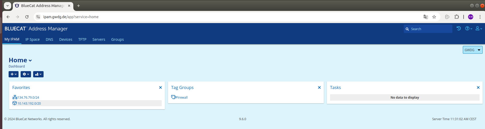
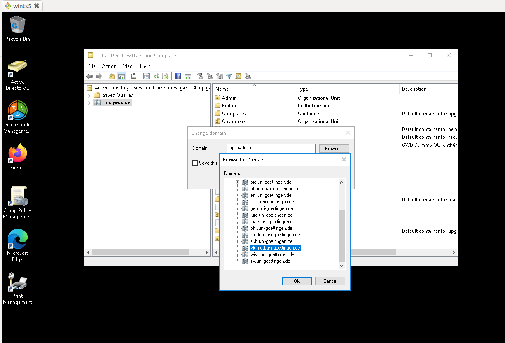
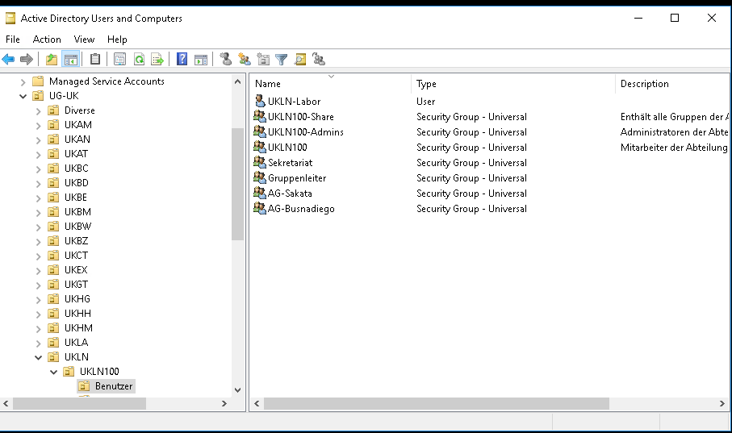
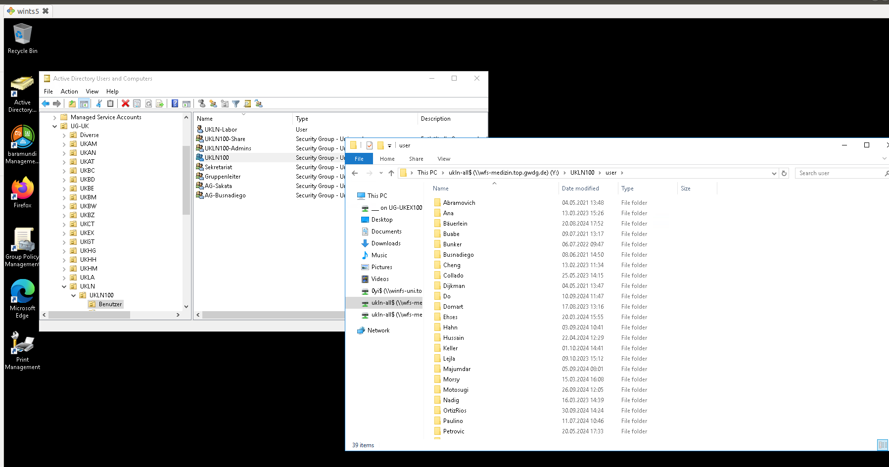
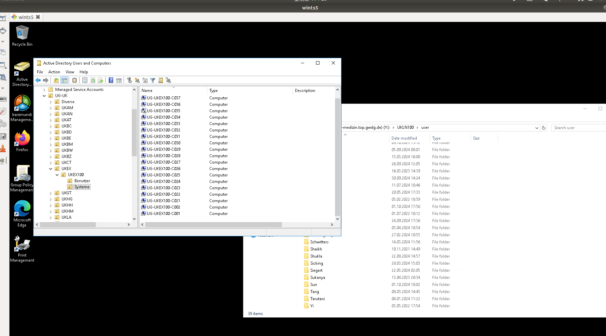
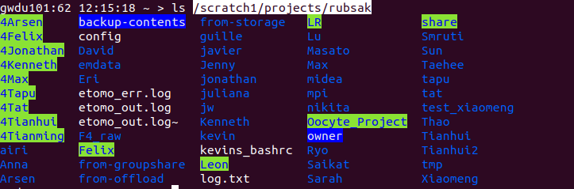
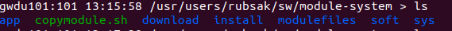
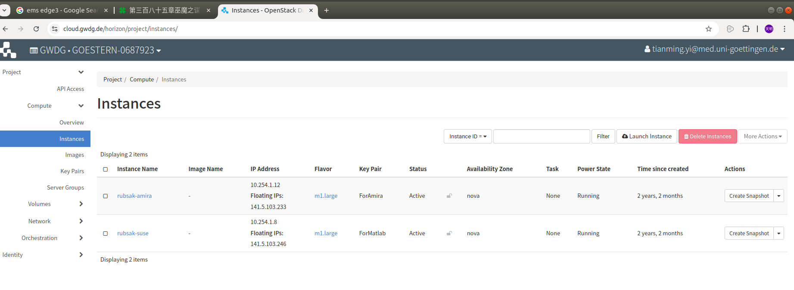

# 1 IT Work

## 1.1 Wiki System

https://rubsak.wiki.gwdg.de/

Usernames and passwords need to be created and provided by the administrator. Tat also has admin privileges.

## 1.2 Admin Accounts and Permissions

When handing over responsibilities between administrators, the new administrator needs to create the relevant accounts and obtain the required permissions.

The **zero account** is a special admin account, with usernames starting with "0". Certain administrative permissions can only be assigned to the zero account and must be requested from GWDG.

The [IPAM](https://ipam.gwdg.de/) system permissions allow users to manage certain network segments, which must be requested from GWDG.

HPC permissions, including access to the software installation directories on HPC, need to be transferred to the new administrator, and permission must be requested from HPC.

**Matlab license** administrator permissions.

[GWDG Cloud](https://cloud.gwdg.de/horizon/project/instances/): Users must request cloud access permissions from GWDG. The management of the two instances, rubsak-amira and rubsak-suse, including passwords and certificates, should also be transferred.

**Active Directory** admin permissions: The new admin account must be added to the corresponding admin group in Active Directory. The previous admin can handle this.

Passwords and keys for servers we maintain, such as storage servers, as well as admin accounts for office computers.

## 1.3 Network Management

### 1.3.1 Physical Connections

Office computers and servers are distributed across the GZMB and Physics buildings, both connected to the network via cables plugged into wall outlets or switch ports.

Before connecting devices, we need to ensure the network ports are properly connected to the core network and configured with the correct VLAN.

Each VLAN corresponds to a different network address range, and network rules can be configured for each VLAN.

We manage three network address ranges for three VLANs, which are explained in the IPAM section.

The physical connection process involves ensuring that the wall ports or switch ports are connected and configured to the designated VLAN ID.

Different locations have different port configuration procedures, which can be categorized into three types:

1. **GZMB wall network ports:** After determining the room number and port number, contact the GZMB network admin on the ground floor. I don't have their email at the moment. Previously, I contacted: Wegner, Alexander Peter <alexander.wegner@med.uni-goettingen.de> for port patching, but since he's been busy, it's best to go through the GZMB network admin.
2. **Physics building corridor switches:** Simply email <support@gwdg.de> with the switch and port numbers, along with the VLAN number that needs to be matched, and they will configure it remotely.
3. **Physics wall ports:** Note the port number, then go to room D-1.109 and connect the wall port to the designated switch port.

Additionally, for 10G network use in the Physics building, you need to connect to the 10G SFP interface. Ensure the correct SFP module is used based on the computer's network port. The switches are Aruba brand, so ensure the SFP module is compatible by consulting GWDG support with the switch model for exact requirements.

All servers requiring 10G network access are already set up with 10G connections.

### 1.3.2 IPAM Online Network Configuration



IPAM network configuration can be done online at https://ipam.gwdg.de/.

We have three available subnets:

1. **VLAN 79**: 134.76.79.50~134.76.79.70, 134.76.79.200~134.76.79.210. This subnet is used for devices needing public IPs. Due to security and GWDG firewall restrictions, we're phasing out this subnet, though a few devices remain on it.
2. **VLAN 425**: 10.143.192.0/24, an internal network IP range accessible externally via VPN. Most devices are on this subnet.
3. **VLAN 426**: 10.143.193.0/24, an internal-only subnet without internet access, reserved for high-security devices.

In addition to viewing which IP address is assigned to each device in the IPAM system, we also maintain a document in the group storage that records the mapping of wall ports, computers, and IP addresses: IT-works/devices.xlsx.

### 1.3.3 Connecting to eduroam

Many issues can be resolved by searching for GWDG + the issue name to find relevant online documentation.

For example, searching GWDG + eduroam brings up this document:

https://docs.gwdg.de/doku.php?id=de:services:network_services:eduroam:start

Refer to the above documentation to resolve wireless network connection issues.

### 1.3.4 Others

All our networks are within a network called **GONET**, which has access rules and restrictions.

By default, all IP addresses are restricted to GONET, even public IPs, limiting access to all ports.

These restrictions can be adjusted by contacting <support@gwdg.de>. For example, a request can be made to allow a particular subnet to be accessed via VPN and to open certain port restrictions.

Currently, ports 22 (SSH) and 3389 (RDP) are open for VPN connections, allowing remote access.

Due to GWDG firewall restrictions, there's no method yet for external users (i.e., those not using VPN) to transfer data directly to our servers via SSH or FTP.

For future large-scale external data transfer needs, this document may offer some ideas:

https://docs.hpc.gwdg.de/how_to_use/data_transfer/index.html

## 1.4 Managing Computers and Servers

New computers and servers need system installations, permissions set, and required software installed.

Handling issues with software installations or resolving hardware failures is also required.

### 1.4.1 Installing New Machines

GWDG offers a paid system management tool called **Baramundi** for remote OS installation, software installation, and settings configuration. However, due to its complexity and our limited number of devices, we don't use it.

I have prepared several different bootable USB drives for installing different operating systems.

#### 1.4.1.1 Windows Office Computers

##### 1.4.1.1.1 System and Software Installation and Activation

Install Windows OS using a bootable USB drive, and choose either Windows 10 or Windows 11 based on the user's needs.

Install the **Windows Education Pro** version, as only the Pro version supports Active Directory.

When setting up the username and password, use a unified local admin username and password for easier management. This confidential information will be shared privately.

After the OS is installed, the only required software is Office.

Activate Windows and Office using **KMS**. Some installation packages and activation scripts are on the USB drive.

We also store the scripts on this GitHub repository: https://github.com/rubenlab/it-scripts.

[Activating Windows and Office using KMS](https://docs.gwdg.de/doku.php?id=en:services:general_services:software_and_license_management:mskms).

Before using KMS, ensure the system or software's product key meets the requirements, which is handled in the USB scripts. There are two scripts for activating Office: one modifies the product key, and the other activates it through KMS.

##### 1.4.1.1.2 Active Directory and Permission Settings

For office computers, another task is adding the computer to the **Active Directory Domain**. Our domain is vk-med.uni-goettingen.de. You can configure this by right-clicking on the computer, opening the management page, and using the advanced rename option.

Once the computer is added to the Active Directory and restarted, it requires a GWDG account to log in. The login format is **GWDG\username**, and the password is the same as the GWDG account and email password. Note that for student accounts, the prefix will differ.

To grant sufficient permissions to the user, add the user to the **Administrator**, **Device Owner**, and **Remote Access** local groups.

Additionally, in the **Local Group Policy**, disable **profile sync** for users to avoid long login times caused by network profile syncing.

##### 1.4.1.1.3 Driver Installation

Use **Driver Booster** to automatically install necessary drivers. Be sure to uncheck the option to install associated software during installation to avoid unnecessary programs. After installation, you can uninstall Driver Booster.

Occasionally, after system upgrades, driver issues (e.g., network disconnects) may occur, requiring Driver Booster to update the drivers again.

##### 1.4.1.1.4 Network Connection

First, test the wall port to ensure it is functional using a laptop + USB network adapter (pre-configured with the MAC address for two network segments). If the laptop connects to the network and receives an IP address, the port configuration is correct.

Then, configure the computer's MAC address in the IPAM system to complete the network configuration. Note that the configuration isn't applied immediately.

[IPAM Deployment Schedules](https://docs.gwdg.de/doku.php?id=en:services:network_services:ipam:start).

##### 1.4.1.1.5 Connecting Printers

Refer to the following documentation:

https://rubsak.wiki.gwdg.de/doku.php?id=computers:print&s[]=printer.

Since the printer must be connected to a specific user, it requires the user to be present to log into their account to configure the printer connection.

Wi-Fi printing is restricted by Active Directory permissions, and since the printer is borrowed from another lab, we haven't set up permissions for it. Only wired connections to the printer are available.

#### 1.4.1.2 Linux Servers

Installing Linux servers is simpler than Windows. You can install via a bootable USB.

One thing to watch for is partitioning. It is beneficial to create separate partitions for the system path `/` and user path `/home` to facilitate system upgrades, though typically we just create a single `/` partition.

The network configuration process is the same as previously mentioned.

We usually install either Ubuntu or Linux Mint. Most of our current servers run Linux Mint.

#### 1.4.1.3 Dual-Boot Office Computers

For dual-boot installations, we usually install Windows first. If we need to modify an existing Windows system, we first **shrink the disk space** to leave enough space for the second operating system.

When installing the second OS, select manual disk partitioning, and install it in the unallocated space.

### 1.4.2 Overview of Existing Servers

Below is the order of servers as they are physically arranged in the server rack, from bottom to top.

All Linux servers have **ssh** and **xrdp** services installed, so they can be accessed either through the command line using SSH or via the graphical interface using an RDP client.

The **xrdp** service supports multiple users, though only one user can access a particular account at a time.

#### 1.4.2.1 Storage Server

**IP**: 10.143.192.12

This is a **TrueNAS** storage server. It has 8 SSD drive bays (7 used) and 28 HDD bays (all used).

The 7 SSD drives are configured as a single logical drive via a hardware RAID controller, and TrueNAS is installed on it. One SSD slot is unused, containing a damaged SSD that is not included in the RAID array, which causes a red light indicator. The RAID array configured by the RAID controller can be modified either in the BIOS or by using the appropriate software for the controller model. Currently, we only configure it via BIOS, and checking its health status also requires rebooting into the BIOS.

The 28 HDDs are configured via TrueNAS into a large pool.

This pool provides remote disk mounting services for other servers via NFS. Other servers can copy data to the storage server for storage.

TrueNAS has a management interface, accessible via the server's IP address. There are online resources available to learn how to manage the TrueNAS system.

There is a key user on the TrueNAS server named **falcon4**. In their home directory, there are several important directories and scripts:

- `/mnt/pool1/home/falcon4/share`: This is the shared directory. You can see the related NFS share settings in the TrueNAS NFS configuration page. Other servers can remotely mount this directory.
- `/mnt/pool1/home/falcon4/mount-f4.sh`: This script mounts the **falcon4 server** disks to the storage server after rebooting, enabling data synchronization.
- `/mnt/pool1/home/falcon4/sync-falcon4.sh`: This script, run in a background **tmux** session, continuously synchronizes data from the **falcon4 server** to `/mnt/pool1/home/falcon4/share/f4server` using the **rsync** command.
- `/mnt/pool1/home/falcon4/tohpc.sh`: This script is used to manually transfer data to the HPC. Normally, it's not used directly but is called from other application servers, such as the pre-processing server. This script uses a passwordless key tied to the admin account (currently mine, **yi1**), so if the admin is changed, the script must be updated with the new account.

#### 1.4.2.2 Pre-Processing Server

**IP**: 10.143.192.4

This server is used for electron microscope data processing. The IT admin only needs to assist in maintaining it.

What makes this server special is that it has two network connections—one on the 10.143.192.x network and the other on the 134.76.79.x network—allowing external network access.

Originally, this server was intended to provide an external channel for collaborators to transfer files, but due to GWDG firewall restrictions, the necessary ports couldn't be opened, so this attempt failed.

#### 1.4.2.3 Falcon4 Server

**IP**: 10.143.192.13

This is a server dedicated to cryo-electron microscopy. The IT admin is responsible for managing its network configuration and power connections. We do not have access to or manage this server directly.

The network configuration is unique, with multiple network interfaces—one for internal use (communicating with the cryo-electron microscope) and one for external use (communicating with our servers, connected to the switch and using IP 10.143.192.13). If issues arise, Thermo Fisher might have modified the network configuration. If it can't be resolved internally, a Thermo Fisher engineer should be contacted.

#### 1.4.2.4 Cryosparc Server

**IP**: 10.143.192.14

This server is used primarily for data processing. IT admins assist in maintaining it.

It contains two 7TB **NVMe SSDs** and an **18x7TB SSD RAID array** configured with a hardware RAID controller. The RAID array's health status and configuration can be viewed or modified in the BIOS.

#### 1.4.2.5 WarpM Server

**IP**: 10.143.192.16

This is another data processing server. It's currently running Windows but is prepared for dual-boot installation.

#### 1.4.2.6 Server Rack

**IP**: 10.143.192.15

This is a noise-reduction rack. It may have inadequate cooling capacity in the summer. Contact Helen Bignell <helen.bignell@therackpeople.com>, the supplier of the rack, to inquire about additional cooling components.

You can access the management page by visiting its IP address. Username and password will be shared privately.

#### 1.4.2.7 Uninterruptible Power Supply (UPS)

At the bottom of the rack, there is a UPS unit. However, its internal battery has expired and needs replacement to restore backup power functionality.

#### 1.4.2.8 Remote Disk Mounting

By modifying the `/etc/fstab` file, remote disks can be automatically mounted at startup.

**Falcon4 Storage** mount configuration:

`10.143.192.13://bigdata/StorageServer/OffloadData /mnt/f4server nfs4 _netdev,rw`

**Storage Server** mount configuration:

`10.143.192.12://mnt/pool1/home/falcon4/share /mnt/storage nfs vers=3,_netdev,rw`


If mounting fails at startup, use the `sudo mount -a` command to manually re-mount. If there is an error, troubleshoot based on the error message.

### 1.4.3 Other

There are two sets of common admin accounts and passwords. A few machines use **admin_lokal** as the admin account.

There are several PCs in GZMB used to operate lab equipment. Sometimes issues like disk space shortages or network connection problems arise and need to be addressed.

In GZMB, the **AKTA** and **AKTA PC** sometimes have connection issues. Since the AKTA PC is shared with another lab, its network connection or settings are occasionally altered. The AKTA PC has two network ports, but only one is needed for us. Sometimes the wrong port is used, or DHCP auto-assigned IPs are changed to static IPs.

When PC disk space runs low, use the free **TreeSize** tool to analyze disk usage and resolve the issue.

A common cause is the automatic syncing of remote directories, which can lead to excessive file accumulation. The **CSC directory** on the C drive may occupy significant space. This directory is difficult to delete directly. First, disable sync settings in the **Sync Center**, then adjust permissions with an admin account before deleting it. You can find guides online on how to delete the Windows CSC directory.

## 1.5 Group Storage

This is an internal shared directory for storing shared files.

For connection details, refer to this document:

https://rubsak.wiki.gwdg.de/doku.php?id=computers:share&s[]=ukln100

Instructions on how to configure access permissions and add new users can be found in the **Active Directory** section.

## 1.6 Active Directory

Active Directory is a Windows service used to manage various aspects, which you can learn more about online.

We mainly use it to allow users to log into PCs with their **GWDG account** (as mentioned earlier) and to set access permissions for shared directories.

We manage two Active Directory groups: **UKLN100** for group storage management and **UKEX100** for assigning Active Directory names to computers.

### 1.6.1 Managing Group Storage Permissions

Access the remote desktop software to log into **gwd-wints5.top.gwdg.de**.

Open the **Active Directory** application on the desktop, right-click **top.gwdg.de**, and select **change domain** to switch to **vk-med.uni-goettingen.de**. Then select **UG-UK**, and within that, select **UKLN** and **UKLN100**.



This will open the following role management page:



The main roles here are **UKLN100-Admins** and **UKLN100**.

Add any user to the **UKLN100-Admins** group, and they will have admin permissions to manage the **UKLN100** user group.

For new lab members, they are usually added to the **UKLN100** user group. A directory is created under the **user** folder named after the user's last name, and the directory permissions are modified—**UKLN100** user group access is removed, and **Full Control** permissions are granted to the user.



### 1.6.2 Assigning Active Directory Names to Computers

Similar to **UKLN100**, open **UKEX100**, and click on **Computers** to view the list of existing computers.

When a new computer needs to be connected to Active Directory, add it here following the existing naming conventions.

As mentioned earlier, the process of adding a computer to the Active Directory Domain involves renaming the computer using the same name that is added here, ensuring the computer connects to the Active Directory Domain correctly.

Each computer's Active Directory name must be unique. If there is a naming conflict between two machines, one of them will be unable to connect to the Active Directory, causing login issues. To fix this, rename the conflicting machine by disconnecting it from the Active Directory with an admin account and reconnecting it with a unique name.



## 1.7 HPC and Server Software Installation

HPC introduction: https://rubsak.wiki.gwdg.de/doku.php?id=computers:hpc&s[]=hpc

### 1.7.1 HPC Directory Structure

#### 1.7.1.1 User Home Directory: `/usr/users/${USER}`

This directory has limited space, and each user's usage is isolated. It is used for storing personal files.

#### 1.7.1.2 Group Directory: `/scratch1/projects/rubsak`



This directory is shared by all HPC users in the lab. Each user creates their own subdirectory named after their first name.

The **rubsak** directory has hundreds of terabytes of storage space for storing and processing experimental data. Despite the large capacity, inactive data should still be backed up and moved to the **archive** directory to avoid running out of disk space.

The `/scratch1/projects/rubsak/from-storage` directory is used to store data transferred from the storage server. For convenience, these files are transferred by the admin and are stored with admin permissions. Once the transfer is complete, the group users should be granted write permissions to move the files to their own directories.

The `chowntome` command (`alias chowntome='/usr/users/rubsak/sw/archive/chowntome.sh'`) can be used by users to change the ownership of a directory to themselves.

#### 1.7.1.3 Admin Directory: `/usr/users/rubsak/sw`

This directory is owned by the administrator and is used to install shared software on the HPC.

### 1.7.2 HPC File Backup

Inactive files stored in the `/scratch1/projects/rubsak` directory should be moved to the **archive** disk. The archive disk is a tape storage system, suitable for storing a small number of large files. Therefore, directories or multiple small files should be compressed into one large file before moving to the archive. Each file must also be less than 1TB, as the tape storage system cannot store files larger than that.

Official documentation: https://docs.hpc.gwdg.de/how_to_use/the_storage_systems/data_stores/archive_perm/index.html

#### 1.7.2.1 User Personal File Backup

Location: `/usr/users/a/${USER}`

We use the `backup` command (`alias backup='/usr/users/rubsak/sw/archive/backup.sh'`) to help users back up directories.

```
Usage：backup.sh [option]... file
Backup a folder or a file to /usr/users/a/yi1/backup folder.
  -t, --top archive every top file inside specific folder.
  -d, --dest=DEST default dest folder is backup, change it to some other path. It should be a relative path to /usr/users/a/yi1
  -v, --verbose show verbose output during the tar operation.
```


This command automatically splits directories into several compressed files no larger than 500GB each and moves them to the **archive** directory.

To restore files from the backup, use the `restore` command (`alias restore='/usr/users/rubsak/sw/archive/restore.sh'`), with the usage: `restore.sh ${archive_folder} ${output_folder}`.

#### 1.7.2.2 Admin Archive Directory

Location: `/usr/users/a/rubsak/share`

The administrator owns this directory, and other users have read permissions.

Inactive data from former members of the lab should also be archived into backup files and moved to this directory for management.

One important set of data stored here is in `/usr/users/a/rubsak/share/mpi_data/`, which consists of approximately 300TB of data transferred from the Max Planck Institute.

A document explaining the process of creating these backup files and how to restore the data can be found here:

https://github.com/rubenlab/discuss/blob/master/mpi_archive.md

The `/usr/users/rubsak/sw/archive/mpi` directory contains index files recording the original file information corresponding to each archive directory. For example, the file `/usr/users/rubsak/sw/archive/mpi/pool-ruben2-goett/Tat/index.txt` contains information about the archived files in the directory `/usr/users/a/rubsak/share/mpi_data/pool-ruben2-goett/Tat`.

If users want to restore specific data from the MPI archive, they can use the index file to locate the data and restore it from the archive.

### 1.7.3 Installed Software and Maintenance Procedures

Most software installed on the HPC is located in `/usr/users/rubsak/sw`.

Most software is installed using either **conda** or **singularity containers**. The wiki contains documentation on how to use them:

https://rubsak.wiki.gwdg.de/doku.php?id=computers:sw&s[]=software

Typically, you can find the software directories in `/usr/users/rubsak/sw` based on their names. If installed via conda, you can also find the conda environments in `/usr/users/rubsak/sw/conda`.

Software installed via [Singularity containers](https://docs.gwdg.de/doku.php?id=en:services:application_services:high_performance_computing:singularity) is generally stable and doesn't encounter issues over time.

However, software installed via conda has occasionally faced compatibility issues due to conda version upgrades in the HPC environment. In such cases, check which conda version the environment is using, then modify the software loading command to specify the appropriate conda version.

All software modules are loaded via the `/usr/users/rubsak/sw/rubsak.bashrc` file, which loads the necessary modules and defines the software loading commands.

A small number of installed software, and any future installations, are recommended to be managed via the **module system**, detailed below.

### 1.7.4 Module System

The HPC uses the [**Lmod**](https://lmod.readthedocs.io/en/latest/) module system to manage software installation and loading.

HPC documentation: https://docs.hpc.gwdg.de/software_stacks/module_basics/index.html

We have also deployed our own modules in `/usr/users/rubsak/sw/module-system`, which are integrated into the HPC's Lmod system. You can load our custom modules using the `module load` command.

Our custom modules can be loaded because we've added this command to `/usr/users/rubsak/sw/rubsak.bashrc`: `module use /usr/users/rubsak/sw/module-system/modulefiles 2> /dev/null`.

#### 1.7.4.1 `/usr/users/rubsak/sw/module-system` Directory Structure



- `/usr/users/rubsak/sw/module-system/app`: This directory contains module definitions copied from the Max Planck Institute. The `app/install` directory stores installation scripts, and the `app/modulefiles` directory stores the module definition files.
- `/usr/users/rubsak/sw/module-system/sys`: This directory is similar to the `app` directory but contains system-related modules.
- `/usr/users/rubsak/sw/module-system/install`: This directory contains verified installation scripts that can be executed on the HPC.
- `/usr/users/rubsak/sw/module-system/soft`: This directory stores modules installed via the installation scripts.
- `/usr/users/rubsak/sw/module-system/modulefiles`: This directory contains the definition files for the installed modules.
- `/usr/users/rubsak/sw/module-system/copymodule.sh`: This script is used to copy modules from the `app` or `sys` directories to the `install` and `modulefiles` directories. It not only copies the corresponding files but also modifies the paths to suit the HPC environment.

Usage: `./copymodule.sh [--sys] {software_name} {version}`.

`copymodule` cannot solve all compatibility issues on its own, so it's still necessary to read and test the installation and modulefile scripts to ensure they work in the HPC environment.

### 1.7.5 Local Server Module System

The **CryoSparc server** also has a module system deployed.

- **Lmod** installation location: `/opt/lmod`.

There are three configuration files:

- `/etc/profile.d/z00_lmod.sh`: This is the Lmod configuration file that loads the base Lmod settings on startup.
- `/etc/profile.d/z01_modules.sh`: This file contains custom module settings that are loaded after `z00_lmod.sh`.
- `/opt/lmod/lmod/init/.modulespath`: This file specifies `/home/rubsak-admin/modulefiles` as the location where modulefiles are loaded.

The `/home/rubsak-admin/install` directory contains installation scripts for the modules. When installing new modules, refer to the module installation process used in the HPC, making necessary adjustments to paths.

### 1.7.6 GitHub Code Repository

We have created a GitHub organization at https://github.com/rubenlab.

Here is an introduction to some of the repositories:

- [it-scripts](https://github.com/rubenlab/it-scripts): This repository stores scripts used by IT administrators.
- [slurm-scripts](https://github.com/rubenlab/slurm-scripts): This repository documents the software installed on the HPC and includes instructions on writing [slurm](https://docs.gwdg.de/doku.php?id=en:services:application_services:high_performance_computing:running_jobs_slurm) submission scripts. Slurm is the task management system used by HPC.
- [discuss](https://github.com/rubenlab/discuss): This repository records discussions related to IT tasks and the detailed process of archiving MPI data.

## 1.8 Matlab and Amira License Server Management

Both Matlab and Amira licenses are provided through virtual servers hosted on the **GWDG Cloud**.

After activating [GWDG Cloud](https://cloud.gwdg.de/horizon/project/instances/) permissions and transferring the instances, you can see the two computer instances.



### 1.8.1 Matlab License Server

**IP Address**: 141.5.103.246

If the Matlab license needs to be upgraded or a new license needs to be purchased, I haven't performed this process myself. However, there are online resources available, and Matlab service personnel can also be consulted.

### 1.8.2 Amira License Server

**IP Address**: 141.5.103.233

This server is accessible via **SSH**.

The management page can be accessed at `141.5.103.233:8090`.

There may be needs for purchasing new licenses or upgrading the existing ones.

Since I haven't handled the license upgrades, I'm leaving the previous handover documentation and video for reference.

## 1.9 Hardware and Software Procurement

For small items like SFP modules and network cables, you can contact **Dirk** directly for purchase.

For computers and software, you can consult with vendors to get a quote and then contact **Cynthia**. A purchase order form needs to be filled out.

## 1.10 Others

Training videos from the admin sessions I attended, as well as the handover video from **Tapu**, the former employee, detailing how to manage the Matlab and Amira licenses, are stored in the group storage under `IT-works/AdminVideos20231211`.

Emails related to maintaining the **Amira license** have also been saved in this directory.

Some passwords and keys are stored in the `IT-works/credentials` directory.

If you forget the **Windows admin password**, you can use a bootable USB drive to force reset or add a new admin account. Here's a tutorial video: https://www.youtube.com/watch?v=uYFVVur-5cc&list=WL&index=6&t=315s.

I have created several **Singularity containers**, which help address issues related to installing software that might be difficult or face compatibility challenges on the HPC.

In the future, **Singularity containers** might still be useful for some software installations. However, I don't have specific tips to share beyond learning from Singularity's documentation and using AI tools to assist with troubleshooting. Additionally, container images should be built within **GONET**, such as on a server or office computer, before transferring them to HPC since the HPC doesn't allow `build` commands to be executed.

For some software with graphical interfaces, consider using **[VirtualGL](https://www.virtualgl.org/)**, which resolves **OpenGL** compatibility issues between hardware inside and outside of containers.
